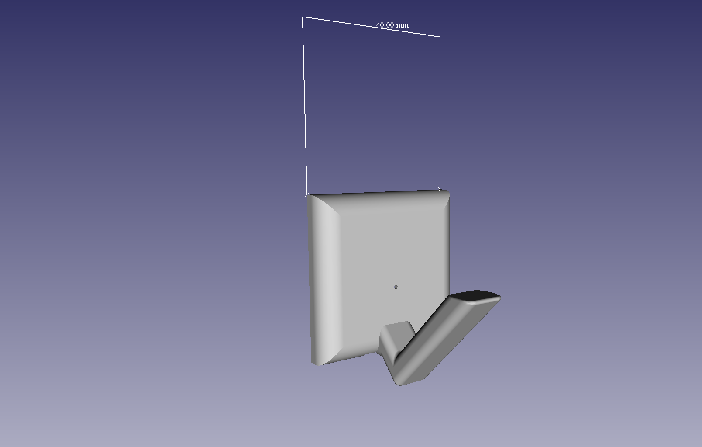
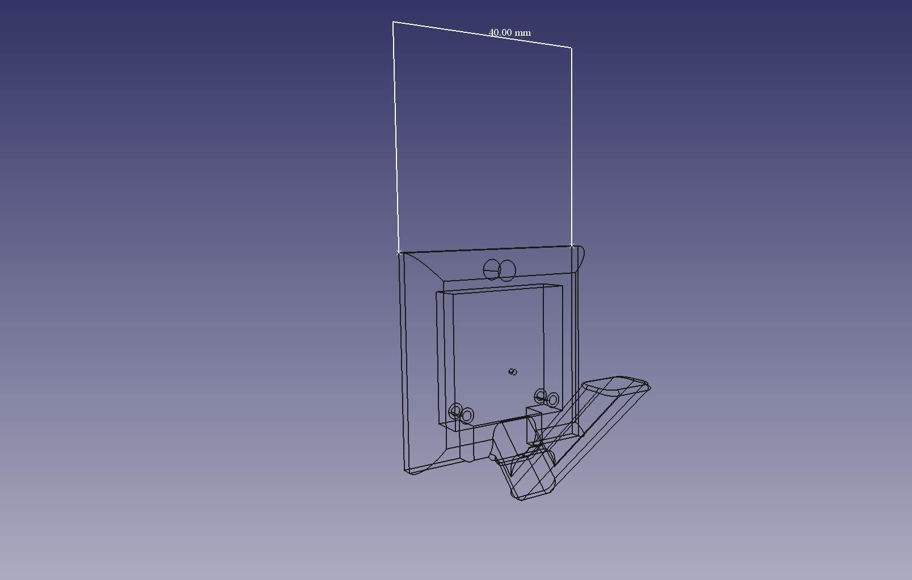
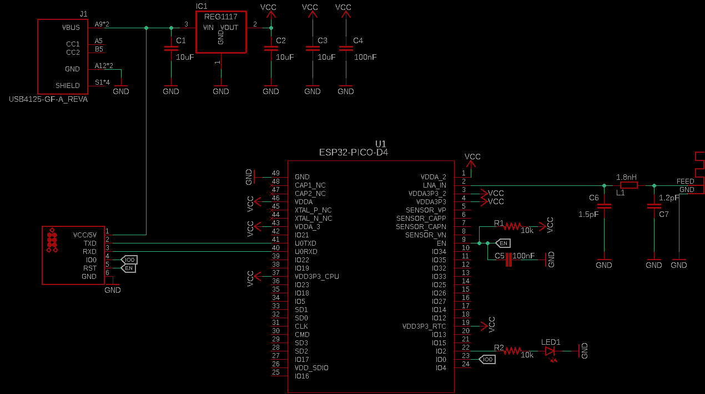
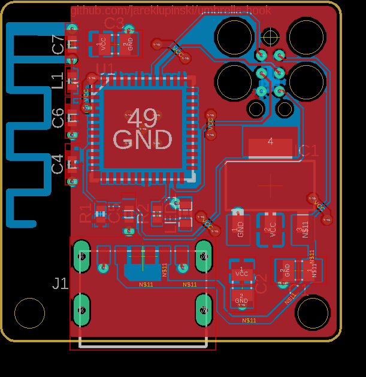

# umbrella-hook
Umbrella hook is a wall-mounted umbrella docking solution that interacts with AI-enhanced Weather Forecasting Services to notify the user of impending sky hydration by emitting a pleasing blue glow.

The intention is that as you glance at your umbrella on your way out the door, if the umbrella-hook is blue, you grab your umbrella.

## How it works

Umbrella-hook contains a small circuit board running a simple program that:
- Offers an interface for connecting umbrella-hook to a WiFi router and setting the umbrella-hook location
- Makes a GET request with the provided location to an API that responds with whether there will be rain in that area, and in how many hours

The umbrella-hook then turns on the on-board LED if the returned hours value overlaps the user's chosen "Rain Warning Time" (default to 6 hours).

